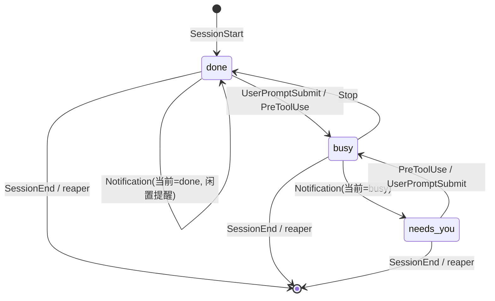

# CC Pulse 需求文档（落地版）

> 版本：v1.2 ｜ 日期：2026-06-05 ｜ 状态：已冻结需求范围，F1 已实现并验证
> v1.1 变更：因体积约束（exe ≤30MB）将展示端技术栈由 PySide6 改为轻量栈（tkinter 优先）。
> v1.2 变更：F1 状态上报端已开发完成并真实验证；新增本节「实施进度与交接」。

---

## 〇、实施进度与交接（给接手的 coding 模型先读这节）

> 本节是写给接手开发的模型/会话的。**F1 上报端已经写完、挂好、真实验证通过**；你的任务是从 **F2 开始做 Windows 展示端（Viewer）**。读完本节再读下面的功能详情。

### ✅ 已完成（F1 状态上报端，无需再动）

1. **上报脚本**：`/home/leo/.claude/hooks/cc-pulse-report.py`（Python，单文件，已实现完整 6 事件状态机、label 解析、进程树抓 claude PID、原子写、异常吞掉 exit 0）。
2. **hook 注册**：已写入 `~/.claude/settings.json`，6 个事件均挂 `python3 .../cc-pulse-report.py`，与原有 hook 并存（备份在 `settings.json.bak.*`）。
3. **验证结果**：7 步模拟全过 + 当前真实会话实测产出正确 state 文件。状态机、Notification 忙/闲区分规则、跨 WSL→Windows 原子写均确认可用。

### 📂 状态目录与数据契约（Viewer 的唯一输入，已是事实，不要改）

- **目录**：Windows `%LOCALAPPDATA%\cc-pulse\state\` ＝ WSL `/mnt/c/Users/<你的用户名>/AppData/Local/cc-pulse/state/`
- **每个活跃会话一个文件**：`<session_id>.json`，会话结束时被删除。
- **真实样例**（实测产出，字段以此为准）：

```json
{
  "session_id": "d05ea258-b451-4667-9629-5c37824d1748",
  "status": "busy",
  "label": "工具链",
  "cwd": "/mnt/c/Users/你的用户名",
  "pid": 7643,
  "updated_at": "2026-06-05T15:57:15+08:00",
  "wt_session": "ba575955-9755-4991-90f8-edba8efed2ce"
}
```

- `status` ∈ `busy`(🟡) / `needs_you`(🔴) / `done`(🟢)；Viewer 按 F2 的颜色表渲染。
- 文件可能被 reporter 原子替换或被 reaper 删除，**Viewer 必须容忍读到瞬时缺失/损坏**（跳过、下轮重试）。

### 🔜 待开发（你的工作范围：F2–F6，纯 Windows 本地 tkinter）

按此顺序做，每步带验收点：

| 步骤 | 内容 | 验收点 |
|------|------|--------|
| 1 | **F2 主窗体骨架**：无边框 + 置顶 + 半透明 + 可拖拽的小窗 | 窗口能浮在桌面最上层、能拖动、能调 alpha |
| 2 | **F2 列表渲染**：每 ≤1s 轮询 state 目录，按 `updated_at` 降序画「label + 三态色点」，默认 3 行可滚动 | 手动改/删 state 文件，窗口 1s 内跟着变色/增减行 |
| 3 | **F3 待机宠物**：state 目录无有效文件时切换成打盹小 Claude 动画 | 清空目录→显示宠物；出现文件→切回列表（含 1.5s 防抖） |
| 4 | **F4 标题栏**：📌 置顶切换 / ⚙️ 设置 / ✕ 关闭 | 三个按钮各自生效 |
| 5 | **F5 设置 + 持久化**：透明度(20–100)、宽、高，写 `config.json`，重启还原 | 改完关程序再开，设置保留 |
| 6 | **F6 reaper**：每 5s 经 `wsl.exe bash -c '…'` 对各 state 的 `pid` 做 `kill -0`，死进程文件删除；`pid=0` 走 30 分钟超时 | 强杀一个 claude 终端后，对应行在数秒内消失 |
| 7 | **打包**：PyInstaller `--onefile --windowed`，确认 exe ≤30MB | 双击单 exe 直接运行 |

> 先打通 1→2→3（上报已就绪，能立刻看到真实三态），再做 4→5→6→7。

### 🧪 你怎么自测（不依赖真开 claude）
往 state 目录手动丢/改/删 `xxx.json`（照上面样例），Viewer 应实时响应。真机联调时，新开任意 claude 窗口即会自动产出真实 state。

---

## 一、概述

### 1.1 产品背景
- **为什么做**：用户习惯同时开多个 Claude Code 终端窗口（每个窗口一个 agent 在跑），工作中又频繁切到 WPS、浏览器等前台应用，一旦离开 CLI 就无法感知各 agent 的运行状态。
- **现状与痛点**：目前只能一个个把终端切回前台，逐个查看是在 thinking、停下来等输入、还是早就跑完了在空等——切换成本高、容易漏掉"在等我"的窗口、也会让已完成的任务白白空转。

### 1.2 产品目标
- 不切窗口，瞄一眼桌面角落即可掌握**每个活跃 agent 的三态**（忙 / 等你操作 / 已完成）。
- 状态来源**准确**（agent 主动上报，非截屏猜测），延迟 ≤ 1 秒。
- 无 agent 运行时，降级为一只打盹的像素小 Claude，做轻量陪伴而非干扰。

### 1.3 目标用户
- **画像**：重度使用 Claude Code、习惯多窗口并行、频繁在 CLI 与其他桌面应用间切换的开发者（首位用户 = 本人，WSL2 + Windows Terminal + `ccc/cct/ccw` 启动器）。
- **使用频率**：每个工作日高频，常驻后台。

### 1.4 需求范围
- **本期包含**：
  - hook 状态上报端（WSL 侧）
  - Windows 置顶 / 半透明 / 可拖拽的悬浮状态栏
  - 每会话一行，三态色点 + 标签，默认 3 行、超出滚动
  - 标题栏三控件：置顶切换 📌 / 设置 ⚙️ / 关闭 ✕
  - 设置项：半透明度、窗口宽高（可调并持久化）
  - 无 agent 时的打盹像素小 Claude（带动画）
  - 残留会话自动清理（防止终端被强杀后留下幽灵行）
- **本期明确不做**：
  - 任何点击交互（切窗口到前台 / 看最近消息 / 直接回复）——纯展示
  - 智能显隐（自动弹出/缩小）——本期常驻
  - 更细状态（报错、危险权限细分）、历史记录、用量统计
  - 多用户 / 云端 / 账号体系

### 1.5 产品形态与技术约束
- **形态**：Windows 原生桌面悬浮窗 exe（无边框、置顶、半透明、可拖拽） + WSL2 内的 hook 脚本。
- **体积约束（硬性）**：最终 exe **≤ 30MB**，目标 10MB 上下。据此放弃 PySide6/Electron 等重型 GUI 栈。
- **账号系统**：不需要。
- **数据**：全部本地。状态文件落在 Windows 与 WSL 都能访问的路径：
  - Windows 侧：`%LOCALAPPDATA%\cc-pulse\state\`（即 `C:\Users\Le'o\AppData\Local\cc-pulse\state\`）
  - WSL 侧：`/mnt/c/Users/Le'o/AppData/Local/cc-pulse/state/`（路径含 `'`，所有脚本必须加引号）
- **第三方依赖**：无网络服务。仅依赖 Claude Code 自带 hook 机制 + 打包进 exe 的运行时。

### 1.6 文案人设（全局）
- **风格**：轻松、可爱、极简。状态栏本身几乎无文字（只有标签 + 色点），文案集中在空状态、宠物、错误提示。
- **语气**：像个安静的小伙伴。宠物睡觉时冒"z z z"，醒来时眨眼。不啰嗦、不打扰。

---

## 二、功能列表（含优先级）

| 编号 | 功能 | 优先级 | 一句话说明 |
|------|------|--------|-----------|
| F1 | 状态上报端（hook reporter） | P0 | 各会话通过 hook 把三态写入共享状态文件 |
| F2 | 置顶悬浮状态栏（主窗体 + 会话列表） | P0 | 置顶半透明可拖拽小条，每会话一行三态色点+标签 |
| F3 | 待机宠物 | P0 | 无任何会话时显示打盹的像素小 Claude |
| F4 | 标题栏控件（置顶/设置/关闭） | P0 | 📌 切换置顶、⚙️ 打开设置、✕ 退出程序 |
| F5 | 设置（半透明度/窗口尺寸 + 持久化） | P0 | 调透明度和宽高，关程序后记住 |
| F6 | 残留会话清理（orphan reaper） | P0 | 终端被强杀后，自动移除幽灵行 |

> P0 = MVP 必须。本期全部为 P0（范围已收敛到最小可用）。

---

## 三、功能详细说明

### F1 — 状态上报端（hook reporter）　✅ 已实现并验证（详见〇节「实施进度与交接」，以下为设计说明，接手者无需重做）

把"监听窗口"反转成"agent 主动汇报"：在 `~/.claude/settings.json` 注册若干 hook，每个事件触发一个轻量脚本 `cc-pulse-report`，读取 hook 经 stdin 传入的 JSON（含 `session_id`、`cwd` 等），计算新状态并**原子写入** `state/<session_id>.json`。

> ⚠️ **实现前须核对官方 hook 文档**：各事件经 stdin 传入的 JSON 字段名（如 `session_id` / `cwd` / `hook_event_name` / `transcript_path`）以及 `SessionStart`/`Notification`/`SessionEnd` 的可用性与载荷，以 Claude Code 官方 hooks 文档为准（本机已装 hook-development skill 可参考）。本文按通用字段名书写，落地时以实测为准。

#### 1) 用户流程 / 路径
- **正常路径**：用户在某终端敲回车 → `UserPromptSubmit` hook → 写入 `busy` → agent 干活，每次工具调用 `PreToolUse` 续写 `busy` → 答完一轮 `Stop` hook → 写入 `done`。Viewer 在下一个轮询周期（≤1s）刷新该行色点。
- **异常路径**：
  - agent 中途需要权限确认 → `Notification` hook，按"原状态是 busy → 置 `needs_you`"规则 → 🔴；用户批准后下一个 `PreToolUse` → 回到 `busy` 🟡。
  - 会话正常结束（`/exit` 或关窗）→ `SessionEnd` hook → 删除该 `state` 文件 → 行消失。
  - 会话被强杀（无 `SessionEnd`）→ 文件残留 → 交由 **F6 reaper** 清理。

#### 2) 状态机

| 状态 | 进入条件 | 退出条件 | 用户可见表现 |
|------|---------|---------|-------------|
| `done`（初始/空闲） | `SessionStart`；或 `Stop` 触发 | 收到 `UserPromptSubmit`/`PreToolUse` | 🟢 绿点 |
| `busy`（忙） | `UserPromptSubmit` 或 `PreToolUse` | `Stop` → done；`Notification` → needs_you | 🟡 黄点 |
| `needs_you`（等你操作） | `Notification` **且**当前为 `busy` | `PreToolUse`/`UserPromptSubmit` → busy | 🔴 红点 |
| （无文件） | `SessionEnd`，或 reaper 判定进程已死 | — | 该行消失 |

**关键规则（无需解析 Notification 内容即可区分两种 idle）：**
- `Notification` 到达时：**若当前状态为 `busy`** → 置 `needs_you`（说明是任务中途的权限阻塞，真的在等你）；**若当前为 `done`** → 保持 `done`（这是答完一轮后约 60s 的闲置提醒，不是阻塞，不打扰你）。



#### 3) 字段规范（写入 `state/<session_id>.json`）

| 字段 | 必填 | 类型 | 约束 | 说明 |
|------|------|------|------|------|
| `session_id` | 是 | string(uuid) | 文件名同此值 | hook 提供 |
| `status` | 是 | enum | `done`/`busy`/`needs_you` | 见状态机 |
| `label` | 是 | string | ≤ 40 字符，超出 Viewer 端省略号 | **解析优先级见下** |
| `cwd` | 是 | string | hook 的 `cwd` 字段 | 用于推导默认 label |
| `pid` | 是 | int | claude 进程 PID（`$PPID` 链取得） | 供 F6 reaper 判活 |
| `updated_at` | 是 | string | ISO8601 带时区 | 每次写入刷新 |
| `wt_session` | 否 | string | 取环境变量 `WT_SESSION` | 调试/将来扩展 |

**label 解析优先级**（对应"用终端标题"诉求 + 回退方案）：
1. 若用户设置了环境变量 `CC_LABEL`（启动终端前手动 export，如 `CC_LABEL=国贸看板`）→ 用它；
2. 否则用 `cwd` 的目录名（basename，如 `claude-sandbox`、`工具链`）；
3. ⚠️ **不直接读 Windows Terminal 标签页标题**——WSL 进程拿不到 GUI 标题。作为补偿，reporter 可**反向用 OSC 转义序列把终端标题设成 `label`**（P1 选做），让终端标签页和状态栏标签保持一致，等价于"终端标题"。

#### 4) 文案规范
本功能为后台脚本，无 UI 文案。仅日志：写入失败时 append 到 `state/reporter.log`（`set +e` + `exit 0`，绝不阻塞 claude）。

#### 5) 异常状态处理

| 异常 | 表现 / 反馈 |
|------|-----------|
| `state` 目录不存在 | 脚本 `mkdir -p` 后再写；建不出来则静默记日志、退出 0 |
| 写入被打断（半个文件） | **原子写**：先写 `<id>.json.tmp` 再 `mv` 覆盖，Viewer 永不读到半成品 |
| 同会话并发事件 | 单文件读-改-写，极短；按 `updated_at` 时间序天然收敛，单 session 不并发无需加锁 |
| hook 脚本本身报错 | `2>/dev/null` + `exit 0` 兜底，任何失败都不影响 claude 运行 |
| 取不到 PID | 退化：`pid` 写 0，F6 reaper 对 pid=0 改用 `updated_at` 超时（默认 30 分钟）判废 |

#### 6) 需注册的 hook（`~/.claude/settings.json`，与现有 hook 并存）

| 事件 | matcher | 调用 | 作用 |
|------|---------|------|------|
| `SessionStart` | `.*` | `cc-pulse-report start` | 注册会话，置 done |
| `UserPromptSubmit` | `.*` | `cc-pulse-report busy` | 置 busy |
| `PreToolUse` | `.*` | `cc-pulse-report busy` | 续 busy（含权限批准后续跑） |
| `Notification` | `.*` | `cc-pulse-report notify` | 按规则置 needs_you |
| `Stop` | `.*` | `cc-pulse-report done` | 置 done |
| `SessionEnd` | `.*` | `cc-pulse-report end` | 删除 state 文件 |

> 脚本极轻（读 stdin + 写一个小 JSON，<10ms），对工具调用延迟无感。`PreToolUse` 已有 `perms-manager.sh`，这里追加并列一条，互不影响。

---

### F2 — 置顶悬浮状态栏（主窗体 + 会话列表）

#### 1) 用户流程 / 路径
- **正常路径**：开机 / 手动启动 exe → 窗口以上次保存的位置、尺寸、透明度出现在桌面最上层 → 每 ≤1s 轮询 `state/` 目录 → 渲染每个会话一行（标签 + 色点）→ 用户拖动标题栏可挪位。
- **异常路径**：`state/` 目录为空 / 不存在 → 切换到 F3 宠物态；某个 JSON 损坏 → 跳过该行，下个周期重试。

#### 2) 状态机（窗体）

| 状态 | 进入条件 | 退出条件 | 用户可见表现 |
|------|---------|---------|-------------|
| 列表态 | `state/` 中存在 ≥1 个有效会话文件 | 文件数归零 | 标题栏 + 会话行列表 |
| 宠物态 | 有效会话文件数 = 0 | 出现 ≥1 个会话 | 标题栏 + 打盹小 Claude（见 F3） |
| 拖拽中 | 鼠标按下标题栏空白处 | 鼠标松开 | 窗口随光标移动，松开后落点入库 |

#### 3) 字段规范（读取与渲染）
- 每轮：`glob state/*.json` → 逐个解析 → 按 `updated_at` 降序（最近活跃在上）排列。
- 每行渲染：左侧 `label`（单行，超宽省略号），右侧 12px 圆点，颜色映射：

| status | 颜色 | 含义 |
|--------|------|------|
| `needs_you` | 🔴 红 `#E5484D` | 等你操作（最扎眼，优先注意） |
| `busy` | 🟡 黄 `#F5C518` | 忙（thinking / 干活） |
| `done` | 🟢 绿 `#46C28E` | 已完成 / 空闲 |

- 默认可视 **3 行**，超出出现竖向滚动条；行高、字号随 F5 窗口尺寸等比缩放。
- 文字默认白色，窗口底色默认黑灰（`#1E1E1E`），整体透明度由 F5 控制。

#### 4) 文案规范

| 场景 | 文案 |
|------|------|
| 列表正常 | 仅显示 `label`，无多余文字 |
| 某行标签为空（极端） | 显示 `未命名会话` |
| 解析到损坏文件 | 不显示该行，不报错打扰 |
| 列表为空 | 不显示"空列表"，直接进宠物态（F3） |

#### 5) 异常状态处理

| 异常 | 表现 / 反馈 |
|------|-----------|
| `state/` 目录不存在 | Viewer 启动时自动创建；空 → 宠物态 |
| JSON 损坏 / 读到半成品 | 跳过该行，下个轮询周期（≤1s）重试，无弹窗 |
| 会话超过 3 个 | 列表区可滚动，窗口本体高度不变 |
| 标签过长 | 中间或尾部省略号，鼠标悬停 tooltip 显示全名（P1） |
| 窗口被拖出屏幕外 | 关程序时若落点超出所有显示器范围，下次启动重置到主屏右上角 |
| 多显示器 | 记住绝对坐标；目标屏不存在时回退主屏 |

#### 6) 关键页面线框图

```
列表态（有会话）：                宠物态（无会话）：
┌─────────────────────────┐      ┌─────────────────────────┐
│              📌  ⚙️  ✕ │      │              📌  ⚙️  ✕ │
├─────────────────────────┤      ├─────────────────────────┤
│ 国贸看板            🔴 ┃│      │                         │
├──────────────────────┃─┤      │      ╔═══════╗  z z      │
│ claude-sandbox      🟡 ┃│      │      ║ (｡ᴗ｡) ║  z        │
├──────────────────────┃─┤      │      ╚═══════╝           │
│ 工具链              🟢  │      │    小 Claude 打盹中…     │
└─────────────────────────┘      └─────────────────────────┘
 （默认3行，更多向下滚动 ┃）        （无 agent 在跑）
```

---

### F3 — 待机宠物

#### 1) 用户流程 / 路径
- **正常路径**：`state/` 有效会话数 = 0 → 列表区替换为一只睡觉的像素小 Claude（GIF/精灵动画循环播放，偶尔翻身、冒"z z z"）→ 一旦出现新会话，立即切回列表态。

#### 2) 状态机

| 状态 | 进入条件 | 退出条件 | 表现 |
|------|---------|---------|------|
| 打盹 | 会话数 0 | 会话数 ≥1 | 睡觉动画循环 + 飘 z |
| （隐藏） | 会话数 ≥1 | 会话数 0 | 让位给列表 |

> MVP 只做"打盹"一种动画；醒来/眨眼等留作 P1。

#### 3) 字段规范
- 动画资源：`assets/claude_sleep.gif`，建议 64×64 像素风，6–8 帧循环，透明背景。**需美术产出一份**（可先用 demo 里那只粉色像素生物）。
- 用 tkinter PhotoImage 逐帧（或 Pillow）加载播放，随窗口尺寸缩放。

#### 4) 文案规范

| 场景 | 文案 |
|------|------|
| 打盹 | 宠物下方：`小 Claude 打盹中…`（可关，见 F5） |
| 资源缺失 | 回退显示静态 emoji `😴` + 同句文案 |

#### 5) 异常状态处理

| 异常 | 表现 |
|------|------|
| GIF 文件缺失 / 解码失败 | 回退静态图标，记日志，不崩溃 |
| 频繁在 0↔1 会话间抖动 | 进入宠物态加 1.5s 防抖，避免闪烁 |

---

### F4 — 标题栏控件（置顶 / 设置 / 关闭）

#### 1) 用户流程
- 📌 **置顶切换**：点一下在"始终置顶"与"普通层级"间切换，图标实心/空心反映当前态，状态入库。
- ⚙️ **设置**：点开弹出设置面板（F5）。
- ✕ **关闭**：点了直接退出程序（无需二次确认；它是个轻量常驻工具）。

#### 2) 状态机（置顶）

| 状态 | 进入 | 退出 | 表现 |
|------|------|------|------|
| 置顶 ON | 默认 / 点📌 | 再点📌 | 窗口 topmost 开，📌 实心 |
| 置顶 OFF | 点📌 | 再点📌 | 普通层级，📌 空心 |

#### 3)–5) 字段/文案/异常
- 字段：`always_on_top: bool`（入 config）。无输入校验。
- 文案：hover tooltip——📌`置顶/取消置顶`、⚙️`设置`、✕`退出`。
- 异常：取消置顶后被其他窗口遮挡属预期行为，非 bug；关闭时先持久化 config 再退出，异常退出靠 F5 的"每次变更即存"兜底。

---

### F5 — 设置（半透明度 / 窗口尺寸 + 持久化）

#### 1) 用户流程
- 打开设置面板 → 拖**透明度滑块**（实时预览）/ 改**宽**、**高**数值 → 关面板即生效；所有值写入 `config.json`，下次启动还原。

#### 2) 状态机
无独立状态机；设置面板为开/关两态。

#### 3) 字段规范

| 字段 | 必填 | 类型 | 范围 / 校验 | 默认 | 报错/约束 |
|------|------|------|------------|------|-----------|
| `opacity` | 是 | int | 20–100（%）；**下限 20 防止彻底看不见** | 85 | 滑块物理限位 |
| `width` | 是 | int | 160–600 px | 260 | 超范围夹到边界 |
| `height` | 是 | int | 120–800 px | 200 | 同上 |
| `pos_x`/`pos_y` | 是 | int | 屏幕坐标 | 主屏右上 | 越界则重置（见 F2） |
| `always_on_top` | 是 | bool | — | true | — |
| `show_pet_caption` | 是 | bool | — | true | 控制 F3 文案显隐 |

- **持久化策略**：任一项变更立即原子写 `%LOCALAPPDATA%\cc-pulse\config.json`，避免异常退出丢配置。

#### 4) 文案规范

| 场景 | 文案 |
|------|------|
| 面板标题 | `设置` |
| 透明度 | `窗口透明度` |
| 尺寸 | `宽` / `高`（px） |
| 宠物文字开关 | `显示宠物文字` |

#### 5) 异常状态处理

| 异常 | 表现 |
|------|------|
| `config.json` 损坏/缺失 | 用全部默认值启动，并重写一份干净 config |
| 透明度被设到极低 | 已由 20% 下限兜底 |
| 尺寸过小挤压列表 | 行高随之缩小，最少保证 1 行可读；低于阈值时列表区出现滚动 |

---

### F6 — 残留会话清理（orphan reaper）

终端被直接关闭/强杀时 `SessionEnd` 可能不触发，`state` 文件会残留成幽灵行。需主动回收。

#### 1) 流程
- Viewer 每 5s 触发一次回收：把当前 `state/*.json` 的 `pid` 列表交给一个 WSL 端小助手 `cc-pulse-reap`（`wsl.exe bash -c '…'` 一次性批量执行），对每个 pid 做 `kill -0` 判活，**进程已死**的会话文件直接删除。
- pid=0（取不到）的文件：改用 `updated_at` 超时（默认 30 分钟无更新）判废。

#### 2) 状态机
无；纯周期性清理动作。

#### 3) 字段规范
- 输入：`state/` 下所有 `pid`、`updated_at`。
- 配置：`reap_interval=5s`、`stale_timeout=1800s`（写死，P1 再开放）。

#### 4) 文案
无 UI；清理日志 append 到 `reporter.log`。

#### 5) 异常状态处理

| 异常 | 表现 |
|------|------|
| `wsl.exe` 不可用/未运行 | 回收降级为纯 `updated_at` 超时判废（busy/needs_you 阈值设更长，避免误删长任务） |
| 长任务长时间 busy 但 PID 仍在 | `kill -0` 判活通过 → **不误删**（这正是要 pid 判活而非纯超时的原因） |
| 误删后会话仍在跑 | 下一个 hook 事件会重新写回该文件，自愈 |

---

## 四、技术方案与数据模型

### 4.1 技术栈建议（已按 ≤30MB 体积约束重选）

| 层 | 建议 | 理由 / 约束 |
|----|------|------------|
| 展示端 exe | **Python 3.x + tkinter（标准库）** | tkinter 自带 frameless（`overrideredirect`）/ 置顶（`-topmost`）/ 整窗半透明（`-alpha`）/ 拖拽 / GIF 逐帧动画（`PhotoImage`），**零第三方 UI 依赖**，打包体积最小，所有需求均原生可实现 |
| 打包 | **PyInstaller `--onefile --windowed`（可加 UPX 压缩）** | 仅标准库时产出 **约 8–12MB** 单 exe，满足 ≤30MB；UPX 可再压到 ~5–8MB |
| GIF 处理 | 优先 tkinter `PhotoImage` 原生逐帧；如需更稳的缩放/解码可加 **Pillow（+~5MB，总计仍 <20MB）** | 二选一，先试原生 |
| 上报端 | **Bash 或 Python 单文件脚本** `cc-pulse-report` | 由 hook 调用，极轻；与现有 `~/.local/bin/` 脚本同构 |
| 回收助手 | **Bash** `cc-pulse-reap` | 经 `wsl.exe` 被 Viewer 周期调用 |
| 存储 | **本地 JSON 文件**（state/*.json + config.json） | 无需数据库；跨 WSL↔Windows 仅靠文件系统 |
| 通信 | **共享目录轮询（500ms–1s）** | 比 FS 事件更稳（跨 9p 挂载）；30 个小文件轮询开销可忽略 |

**备选栈（均满足 ≤30MB）：**
- **AutoHotkey v2**：编译 exe **~1–2MB**，最极致轻量；置顶/透明/拖拽/读文件原生，缺点是 GIF 动画需 GDI+ 自行实现，代码可读性一般。
- **C# WinForms（.NET，自包含裁剪单文件）**：**~15–25MB**，原生质感最好，`Opacity`/`TransparencyKey`/`TopMost`/`PictureBox` 播 GIF 全原生，缺点是需 .NET SDK 打包链。
- ❌ **已放弃**：PySide6/PyQt、Electron（40–80MB+，超预算）。

> 默认推荐 **tkinter**：体积小、纯标准库、AI 一次成型概率高、需求全覆盖。若你更在意极致体积可转 AHK v2，更在意观感可转 WinForms——三者都在预算内。

### 4.2 数据模型（全局实体）

**实体一：SessionState**（每会话一个 `state/<session_id>.json`）

| 字段 | 类型 | 必填 | 说明 |
|------|------|------|------|
| session_id | string(uuid) | 是 | 主键 = 文件名 |
| status | enum(done/busy/needs_you) | 是 | 当前三态 |
| label | string(≤40) | 是 | 显示标签，解析优先级见 F1-3 |
| cwd | string | 是 | 工作目录 |
| pid | int | 是 | claude 进程 PID，供判活 |
| updated_at | ISO8601(带时区) | 是 | 每次写入刷新 |
| wt_session | string | 否 | 预留 |

**实体二：Config**（单文件 `config.json`）

| 字段 | 类型 | 默认 | 说明 |
|------|------|------|------|
| opacity | int(20–100) | 85 | 透明度% |
| width / height | int | 260 / 200 | 窗口尺寸 px |
| pos_x / pos_y | int | 主屏右上 | 窗口位置 |
| always_on_top | bool | true | 置顶开关 |
| show_pet_caption | bool | true | 宠物文字显隐 |

- **关系**：Viewer 读多个 SessionState（一对多渲染）+ 一个 Config；Reporter 写单个 SessionState；无实体间外键。
- **存储位置**：全部本地，`%LOCALAPPDATA%\cc-pulse\`（state/ 子目录 + config.json）。

### 4.3 关键数据流（无网络）

| 动作 | 输入 | 输出 | 触发时机 |
|------|------|------|---------|
| 写状态 | hook stdin JSON | `state/<id>.json`（原子） | 6 类 hook 事件 |
| 删状态 | session_id | 删除文件 | `SessionEnd` |
| 读状态 | `state/*.json` | 渲染列表/宠物 | Viewer 每 ≤1s |
| 判活回收 | pid 列表 | 删除死会话文件 | Viewer 每 5s 经 `wsl.exe` |
| 读写配置 | UI 操作 | `config.json`（原子） | 启动读 / 变更即写 |

> 本产品无后端、无网络接口，数据全部本地文件读写；读写时机如上表。

---

## 五、附录

### 5.1 待确认问题清单（动工前）
1. **hook stdin 字段 schema**：以官方 hooks 文档实测各事件传入的字段名与可用事件为准（见 F1 顶部提醒）。
2. **PID 获取方式**：hook 脚本作为 claude 子进程，需确认用 `$PPID` 链能稳定取到 claude 进程 PID。
3. **宠物美术资源**：`claude_sleep.gif` 谁来产出？可先用 demo 里那只粉色像素生物临时顶上。
4. **开机自启**：是否需要随 Windows 自启（启动文件夹/注册项）？默认手动启动，可入 P1。
5. **栈最终确认**：默认 tkinter；如选 AHK v2 或 C# WinForms 请动工前定。

### 5.2 给接手 coding 模型的话
> 本 PRD 已冻结需求范围。**F1 状态上报端已开发完成并真实验证（见〇节）——不要重做。** 你的任务是实现 Windows 展示端 Viewer（F2–F6），它的唯一输入是〇节描述的 state 目录与数据契约（已是既成事实，照读即可，不要改格式/路径/字段）。
>
> 技术栈：**默认 tkinter（标准库）+ PyInstaller 打包，最终 exe ≤30MB**（硬约束，勿用 PySide6/Electron）；如有同样满足体积约束的更优选择，可在动工前提出。
>
> 构建顺序与每步验收点见〇节表格：先打通 1→2→3（主窗体→列表→宠物，此时已能看到真实三态），再做 4→5→6→7。自测方式见〇节「你怎么自测」。
