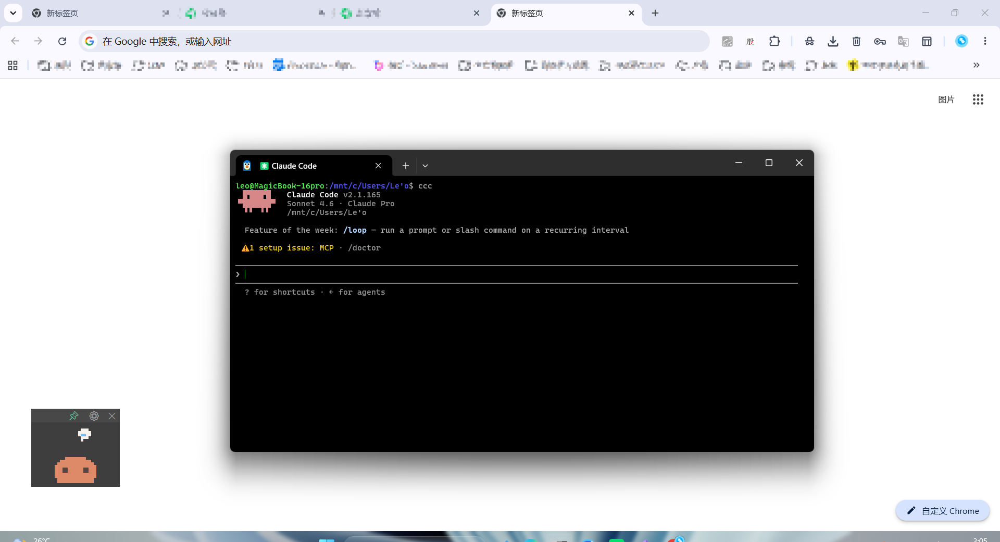
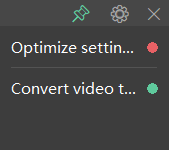
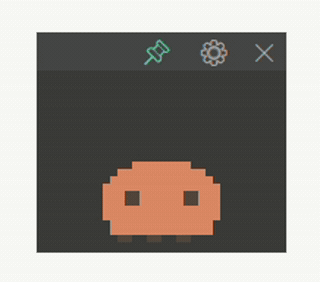
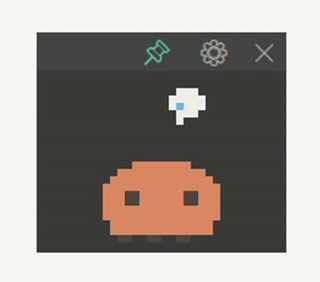
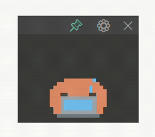
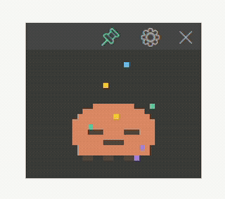
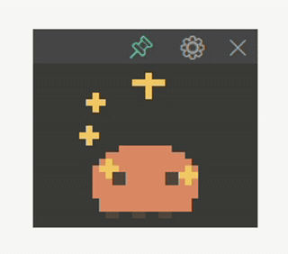
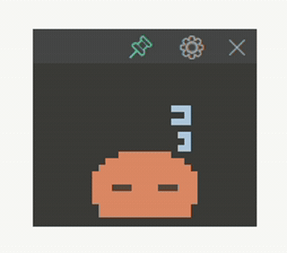

# CC Pulse — Claude Code 桌面状态宠物

不切窗口，瞄一眼桌面角落即可掌握每个 Claude Code 会话的三态：
🟡 忙 / 🔴 等你操作 / 🟢 已完成。无会话时降级为一只打盹的像素小 Claude。

## ✨ 效果展示

### 🖥️ 实际使用效果

<p align="center">
  
</p>

<p align="center">
  <em>左下角的像素小宠物，实时显示你的 Claude Code 状态</em>
</p>

### 🔴🟡🟢 三态状态展示

<p align="center">
  
</p>

<p align="center">
  <em>🔴 等你操作 / 🟢 已完成 — 状态一目了然</em>
</p>

### 🐾 六种像素宠物形态（无会话时随机切换）

<table align="center">
  <tr>
    <td align="center"></td>
    <td align="center"></td>
    <td align="center"></td>
    <td align="center"></td>
    <td align="center"></td>
    <td align="center"></td>
  </tr>
  <tr>
    <td align="center">发呆</td>
    <td align="center">思考</td>
    <td align="center">敲代码</td>
    <td align="center">撒花</td>
    <td align="center">星光</td>
    <td align="center">睡觉</td>
  </tr>
</table>

---

## 🚀 核心特性

- **零侵入** — 无需修改 Claude Code 代码，纯 hook 实现
- **实时状态** — 🟡 忙 / 🔴 等你操作 / 🟢 已完成，一目了然
- **高度可调** — 列表行数随面板高度自适应：拖窗口**底边**即可调高（也可在设置里填高度），同开多个会话时一屏多看几条
- **最小化到托盘** — 收进系统托盘常驻（像微信，始终在托盘）：左键唤起主面板、右键菜单「显示 / 退出」；托盘图标由像素「睡觉」宠物经 `ctypes` 调 `Shell_NotifyIcon` 程序化生成，零第三方依赖，仅 Windows 生效（其他平台自动 no-op）
- **声音提醒** — 任意会话转入 🔴「等你操作」的那一刻播放提示音（`assets/notify.wav`），可在设置里「红点亮起播放提示音」开关；仅 Windows 生效，WSL/其他平台自动静默降级；换音效直接覆盖 `assets/notify.wav`（须为 WAV）即可
- **像素宠物** — 无会话时显示 6 种可爱形象，随机切换
- **纯标准库** — 仅依赖 tkinter + Python 标准库，无第三方依赖
- **轻量打包** — 单 exe 仅 8-12MB，满足 ≤30MB 硬约束
- **跨环境** — 支持 Windows / WSL / macOS（需虚拟机访问 Windows 文件系统）

---

## 🏗️ 架构

```
┌─────────────────────────────────────────────────────────┐
│                    CC Pulse 架构                        │
├─────────────────────────────────────────────────────────┤
│  F1 上报端 (hook)          │  F2-F6 展示端 (Viewer)     │
│  cc-pulse-report.py        │  cc_pulse_viewer.py        │
│  ↓ hook 事件触发            │  ↓ 轮询 state 目录         │
│  ↓ 计算三态                 │  ↓ 渲染列表 + 像素宠物     │
│  ↓ 原子写 state/*.json     │  ↓ tkinter 无边框悬浮窗    │
└─────────────────────────────────────────────────────────┘
              ↓ 共享 state 目录
    见下方「State 目录」章节
```

**本仓库包含：**
- ✅ F2–F6 展示端（Windows tkinter 悬浮窗）
- ✅ F1 上报端（Claude Code hook 脚本）
- ✅ 像素宠物引擎（纯代码 6 形象）
- ✅ 系统托盘（纯 ctypes，零依赖）

---

## 📦 快速开始

### Step 1: 安装 Python（Windows）

需要 **Python 3.10+**（Windows 版，自带 tkinter）。

👉 下载：https://www.python.org/downloads/

安装时勾选 **"Add Python to PATH"**。

验证安装：
```bash
python --version   # 应显示 3.10+
python -c "import tkinter; print('tkinter OK')"
```

### Step 2: 安装 F1 上报端（hook）

这是让 Claude Code 向 Viewer 发送状态的关键。

#### 2.1 找到你的 Claude Code hooks 目录

Claude Code 的 hooks 配置在 `~/.claude/settings.json`，hooks 脚本通常放在：
- **Linux/WSL**：`~/.claude/hooks/`
- **macOS**：`~/.claude/hooks/`
- **Windows (PowerShell)**：`$env:USERPROFILE\.claude\hooks\`

如果目录不存在，先创建：
```bash
# Linux/WSL/macOS
mkdir -p ~/.claude/hooks

# Windows PowerShell
New-Item -ItemType Directory -Force -Path "$env:USERPROFILE\.claude\hooks"
```

#### 2.2 复制 hook 脚本

```bash
# Linux/WSL/macOS
cp hooks/cc-pulse-report.py ~/.claude/hooks/

# Windows PowerShell
Copy-Item hooks\cc-pulse-report.py "$env:USERPROFILE\.claude\hooks\"
```

#### 2.3 修改 hook 脚本中的路径

打开 `cc-pulse-report.py`，修改第 22 行的 `STATE_DIR`：

```python
# Linux/WSL 用户
STATE_DIR = "/mnt/c/Users/你的Windows用户名/AppData/Local/cc-pulse/state"

# Windows 用户（直接运行 Python，不是 WSL）
STATE_DIR = "/mnt/c/Users/你的Windows用户名/AppData/Local/cc-pulse/state"

# macOS 用户（如果用虚拟机运行 Windows）
STATE_DIR = "/mnt/c/Users/你的Windows用户名/AppData/Local/cc-pulse/state"
```

**如何查看你的 Windows 用户名？**
```bash
# 方法 1：在 Windows 资源管理器地址栏输入
%USERPROFILE%

# 方法 2：在 PowerShell 中
echo $env:USERNAME

# 方法 3：在 CMD 中
echo %USERNAME%
```

#### 2.4 修改 hook 脚本中的 Python 路径

打开 `cc-pulse-report.py`，修改第 1 行的 shebang（如果需要）：

```python
#!/usr/bin/env python3
```

如果系统找不到 `python3`，可以改为：
```python
#!/usr/bin/python
```

或者使用完整路径：
```python
#!/c/Users/你的用户名/AppData/Local/Programs/Python/Python312/python.exe
```

#### 2.5 配置 Claude Code hooks

编辑 `~/.claude/settings.json`，添加以下配置：

```json
{
  "hooks": {
    "SessionStart": [
      {
        "type": "command",
        "command": "python3 ~/.claude/hooks/cc-pulse-report.py"
      }
    ],
    "UserPromptSubmit": [
      {
        "type": "command",
        "command": "python3 ~/.claude/hooks/cc-pulse-report.py"
      }
    ],
    "PreToolUse": [
      {
        "type": "command",
        "command": "python3 ~/.claude/hooks/cc-pulse-report.py"
      }
    ],
    "Notification": [
      {
        "type": "command",
        "command": "python3 ~/.claude/hooks/cc-pulse-report.py"
      }
    ],
    "Stop": [
      {
        "type": "command",
        "command": "python3 ~/.claude/hooks/cc-pulse-report.py"
      }
    ],
    "SessionEnd": [
      {
        "type": "command",
        "command": "python3 ~/.claude/hooks/cc-pulse-report.py"
      }
    ]
  }
}
```

**⚠️ 重要提示：**

1. **路径问题**：
   - 如果你在 **WSL** 中运行 Claude Code，用 `python3 ~/.claude/hooks/cc-pulse-report.py`
   - 如果你在 **Windows CMD/PowerShell** 中运行 Claude Code，用 `python %USERPROFILE%\.claude\hooks\cc-pulse-report.py`
   - 如果你在 **macOS/Linux** 中运行 Claude Code，用 `python3 ~/.claude/hooks/cc-pulse-report.py`

2. **Python 命令**：
   - 有些系统需要 `python` 而不是 `python3`
   - 有些系统需要完整路径，如 `/usr/bin/python3`
   - 测试方法：在终端运行 `python3 --version` 或 `python --version`

3. **权限问题**：
   - 确保 hook 脚本有执行权限：`chmod +x ~/.claude/hooks/cc-pulse-report.py`
   - Windows 用户可以忽略此步骤

4. **settings.json 位置**：
   - 全局配置：`~/.claude/settings.json`（所有项目生效）
   - 项目配置：`项目根目录/.claude/settings.json`（仅当前项目生效）
   - 推荐用全局配置

### Step 3: 启动 Viewer

```bash
# 方式 1：直接运行（推荐）
python cc_pulse_viewer.py

# 方式 2：双击 run.bat（Windows）
```

窗口会浮在桌面右上角。此时新开任意 Claude Code 终端，你会看到状态实时变化。

### Step 4: 验证安装

1. 打开一个 Claude Code 终端
2. 发送一条消息（如 "hello"）
3. 观察桌面宠物是否显示 🟡 忙
4. 等待 Claude 回复后，观察是否变为 🟢 已完成
5. 如果需要权限确认，观察是否变为 🔴 等你操作

---

## State 目录

### 默认位置

- **Windows**：`%LOCALAPPDATA%\cc-pulse\state\`
- **Linux/WSL**：`/mnt/c/Users/你的用户名/AppData/Local/cc-pulse/state/`
- **macOS**：不支持原生运行，需通过虚拟机访问 Windows 文件系统

### 如何查看

```bash
# Windows CMD
echo %LOCALAPPDATA%\cc-pulse\state

# Windows PowerShell
echo "$env:LOCALAPPDATA\cc-pulse\state"

# Linux/WSL
ls -la "/mnt/c/Users/你的用户名/AppData/Local/cc-pulse/state/"
```

### 状态文件格式

每个活跃会话一个 `<session_id>.json`，会话结束被删除。

```json
{
  "session_id": "abc123def456",
  "status": "done|busy|needs_you",
  "label": "会话标题",
  "cwd": "/工作目录",
  "pid": 12345,
  "updated_at": "2026-06-07T15:30:00+08:00",
  "wt_session": "Windows Terminal 会话ID（可选）"
}
```

### 三态含义

- 🟢 `done` — 空闲/就绪，等待用户输入
- 🟡 `busy` — 正在执行任务
- 🔴 `needs_you` — 需要用户操作（如权限确认）

### label 解析优先级

由 F1 上报端决定，优先级从高到低：
1. `CC_LABEL` 环境变量（最高优先）
2. `/rename` 自定义标题（transcript 中的 `custom-title`）
3. 自动标题（transcript 中的 `ai-title`）
4. cwd 目录名（最低优先）

> `/rename` 本身不触发 hook，label 在下一次 hook 事件（即你发消息时）才刷新。中间状态有几秒延迟。

---

## 目录结构

```
CC Pulse/
├── cc_pulse_viewer.py          # 主程序（F2–F6，纯 tkinter 标准库）
├── pixelpet.py                 # 程序化像素宠物引擎（纯代码 6 形象）
├── tray.py                     # 系统托盘图标（纯 ctypes 调 Shell_NotifyIcon，零依赖；仅 Windows）
├── hooks/
│   └── cc-pulse-report.py      # F1 上报端 hook（需要复制到 ~/.claude/hooks/）
├── assets/
│   ├── 发呆.gif                # 像素宠物：发呆形态
│   ├── 思考.gif                # 像素宠物：思考形态
│   ├── 电脑.gif                # 像素宠物：敲代码形态
│   ├── 撒花.gif                # 像素宠物：撒花形态
│   ├── 星光.gif                # 像素宠物：星光形态
│   ├── 睡觉.gif                # 像素宠物：睡觉形态
│   ├── demo-terminal.png       # 效果图：Claude Code 终端 + 桌面宠物
│   ├── demo-states.png         # 效果图：三态状态展示
│   └── notify.wav              # 提示音
├── run.bat                     # Windows 快速运行
├── build/
│   ├── build.bat               # PyInstaller 打包（cmd）
│   └── build.ps1               # PyInstaller 打包（PowerShell，带 30MB 校验）
├── tools/
│   ├── make_pet_gif.py         # 用 Pillow 重新生成宠物 gif（仅备料时用）
│   └── test_logic.py           # 纯逻辑 headless 单测（31 项）
└── CC-Pulse-PRD.md             # 需求文档（v1.2）
```

---

## 打包成单 exe（≤30MB 硬约束）

```bash
# cmd
build\build.bat

# 或 PowerShell（带体积校验）
powershell -ExecutionPolicy Bypass -File build\build.ps1
```

产物：`dist\CCPulse.exe`。纯标准库 + 像素宠物引擎，PyInstaller onefile 通常 **8–12MB**，
满足 ≤30MB；如需更小可装 UPX 再压。双击 exe 即用，无需 Python 环境。

---

## 自测（不依赖真开 Claude）

- **逻辑层（任意有 Python 的机器，含无 GUI 的 WSL）**：
  ```bash
  python3 tools/test_logic.py     # 31 项断言全过
  ```
- **界面联调**：往 state 目录手动丢/改/删一个 `xxx.json`（照契约字段），窗口应 1s 内跟着
  变色/增减行；清空目录 → 1.5s 后切宠物态；放回文件 → 立即切回列表。

---

## 功能对照（PRD F2–F6）

| 功能 | 实现位置 | 行为 |
|------|----------|------|
| F2 主窗体 | `overrideredirect`+`-topmost`+`-alpha`+ 标题栏拖拽 | 无边框置顶半透明可拖拽 |
| F2 列表 | `_tick`/`_render_list`（每 800ms 轮询） | 按 `updated_at` 降序，label + 三态色点，默认 3 行可滚动 |
| F3 宠物 | `pixelpet.py`/`_render_pet`/`_animate` | 无会话→**程序化像素宠物**（纯代码逐帧，无图片）：6 形象（发呆/思考/敲代码/庆祝/星光/睡觉）每 10–20s 随机切换；1.5s 防抖 |
| F4 标题栏 | `toggle_pin`/`toggle_settings`/`close` | 📌 置顶切换 / ⚙️ 设置 / ✕ 退出 |
| F5 设置 | `_open_settings` + `_save_config` | 透明度(20–100)/字号偏移(-5~+5)/宽/高/红点提示音开关，即时原子持久化 |
| F6 清理 | `_reap`/`query_alive_pids`/`reaper_decide`（每 5s） | 经 `wsl.exe` 批量 `kill -0` 判活删死会话；pid=0 走 30min 超时；wsl 不可用退化为超时 |

---

## 已知约束与不可压缩的延迟

- **状态切换延迟**：红→黄（needs_you→busy）感知延迟 ~1–2s，其中大部分是 Claude Code 内部从"用户点确认"到"下一个 hook 事件触发"的处理时间，不可压缩。Viewer 轮询 200ms + reporter ~8ms 是可量化的部分。
- **WSL 路径**：状态目录路径可能含特殊字符（如空格、单引号），所有脚本必须加引号。
- **wsl.exe 依赖**：F6 reaper 依赖 `wsl.exe` 做 `kill -0` 判活；WSL 不可用时退化为纯超时判废（busy 阈值 2h，避免误删长任务）。

---

## 自定义宠物

### 替换宠物形象

`pixelpet.py` 使用纯代码绘制像素宠物（20×22 逻辑网格），6 个形象：
- 发呆（默认）
- 思考气泡
- 敲笔记本
- 庆祝纸屑
- 金色星光
- 睡觉 zzz

如需修改形象，编辑 `pixelpet.py` 中对应的帧数据。

### 替换宠物为图片

如想使用自定义图片（GIF/PNG），修改 `cc_pulse_viewer.py` 中的 `_render_pet` 方法。

---

## 开机自启

默认手动启动；如需自启，可把 `dist\CCPulse.exe` 的快捷方式放进：
```
shell:startup
```
（Win+R → 输入 `shell:startup`）

---

## 常见问题

### Q: 运行后没有状态显示？

**检查清单：**
1. ✅ F1 hook 是否已配置（`~/.claude/settings.json`）
2. ✅ State 目录是否存在：`%LOCALAPPDATA%\cc-pulse\state\`
3. ✅ 打开一个 Claude Code 终端，发一条消息，观察 state 目录是否生成 JSON 文件
4. ✅ hook 脚本中的路径是否正确（`STATE_DIR` 变量）
5. ✅ Python 命令是否正确（`python` vs `python3`）

**调试方法：**
```bash
# 1. 手动运行 hook 脚本测试
echo '{"hook_event_name":"SessionStart","session_id":"test123","cwd":"/tmp"}' | python3 ~/.claude/hooks/cc-pulse-report.py

# 2. 检查 state 目录
ls -la /mnt/c/Users/你的用户名/AppData/Local/cc-pulse/state/

# 3. 查看 state 文件内容
cat /mnt/c/Users/你的用户名/AppData/Local/cc-pulse/state/test123.json
```

### Q: 状态切换有延迟？

**正常现象。** 总延迟 = Viewer 轮询间隔（800ms）+ hook 触发延迟（~1-2s）= 1-3s。

如果延迟过长（>5s），检查：
1. hook 脚本是否正常运行
2. state 目录是否可写
3. Python 是否卡住（查看任务管理器）

### Q: 如何修改宠物切换速度？

编辑 `cc_pulse_viewer.py`，搜索以下变量并修改（单位：秒）：
```python
PET_SWITCH_MIN = 10   # 最小切换间隔
PET_SWITCH_MAX = 20   # 最大切换间隔
```

### Q: 如何添加新的宠物形象？

在 `pixelpet.py` 的 `PET_FRAMES` 字典中添加新形象，参考现有帧数据格式：
```python
"new_pet": [
    [0,0,1,1,0,0,...],  # 帧 1（20×22 矩阵）
    [0,1,1,1,1,0,...],  # 帧 2
    ...
]
```

### Q: 如何修改三态颜色？

编辑 `cc_pulse_viewer.py`，搜索以下变量：
```python
COLOR_DONE = "#4CAF50"      # 绿色
COLOR_BUSY = "#FFC107"      # 黄色
COLOR_NEEDS_YOU = "#F44336" # 红色
```

### Q: 如何修改窗口位置和大小？

直接**拖拽标题栏**移动窗口，位置会自动记住（持久化到 `config.json` 的 `pos_x`/`pos_y`）；窗口大小在设置面板（⚙️）「尺寸」组里调「宽 / 高」。两者都无需改代码。首次启动默认在主屏右上角。

### Q: 列表字太小/太大，怎么调？

在设置面板（⚙️）「显示」组里拖动「字号偏移」滑块（-5 ~ +5，每档 ±1px）。

### Q: 如何修改透明度？

在设置面板（⚙️）中调整透明度滑块（20–100%）。

### Q: 如何恢复默认设置？

删除配置文件：
```bash
# Windows
del %LOCALAPPDATA%\cc-pulse\config.json

# Linux/WSL
rm "/mnt/c/Users/你的用户名/AppData/Local/cc-pulse/config.json"
```

---

## 贡献

欢迎提交 Issue 和 Pull Request！

1. Fork 本仓库
2. 创建特性分支：`git checkout -b feature/your-feature`
3. 提交更改：`git commit -m 'Add some feature'`
4. 推送分支：`git push origin feature/your-feature`
5. 提交 Pull Request

---

## 参考项目

- [Clyde on Desk](https://github.com/QingJ01/Clyde)（AGPL-3.0）：同类产品，Tauri + Svelte，SVG 动画，12 个状态。

---

## 许可证

MIT License - 详见 [LICENSE](LICENSE)
